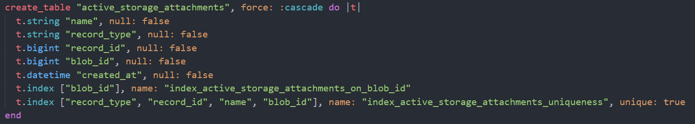

# The Hermetic Exchange

## What is the Hermetic Exchange

The Hermetic Exchange is a videogame web app, where users play as interdimensional magical traders and adventurers. On the app they can buy and sell magical items, purchase ingame currency with real money, and play the odds in The Rift using their currently equipped magical items.

## What is the problem that this app is solving

The Hermetic Exchange is a two way marketplace web game application; users play the game to find randomly generated magical items, and then trade them with eachother on the exchange for credits, which they can then use to buy other items. 

For this project I wanted to create a virtual marketplace somewhat inspired by the cosmetics market from the video game Dota 2, where players of the game buy and/or earn items either with real money or simply by playing the game, and can then trade those items with other players. 

I also wanted to combine this with some of the daily login features of a flash game I used to play called Minitroopers, where every day you could fight another team of troopers for in game rewards (As well as pay real money to upgrade your troopers faster).

## Why is it a problem that needs solving/Explain where the app can be disruptive in the marketplace

This particular kind of virtual game marketplace hasn’t been done before. I wanted to recreate the magic of online cosmetic item marketplaces, integrate some kind of daily login minigame, and combine these with a simple microtransaction model for viable monetisation. 

But there has also never been a marketplace specifically made for interdimensional wizards to haggle over the price of the Teeth of Spontaneous Combustion so thats why this is a very important app to be developing.

## Links

[Heroku Link](https://hermetic-exchange.herokuapp.com/)

[Github Link](https://github.com/asyncronous/hermetic_exchange)

## Description

### Purpose

The purpose of the app is to provide a two-way marketplace for users to sell the items they find while playing the game, and to search for and buy items they might want from other players. The app is designed to be fun to use and to play with, as it’s intended primarily as an entertainment vehicle. 

### Functionality / Features

- Visitors
    -	Can see the home page and view the title of the site, and see a short video showing what it looks like inside
    -	Can see an About page to be informed about what the website is and how it works
    -	Can choose to sign in or sign up as a member to engage with the site further
- Traders
    -	Users of the app are called Traders
    -	Can see all visitors can see
    -	Upon visiting the site see the home page, with the website title and a sign in/sign up prompt
    -	Can register an account, sign in and out, edit their details and delete the account
    -	Can upload their own profile picture
    -	Can ‘Equip’ items for exploration or ‘List’ items on the marketplace
    -	Can see all listed and equipped items on their own dashboard
    -	Can disassemble items for credits based on how much they are worth
    -	Can claim a daily reward of Items and Credits
    -	Can close ‘Rifts’ with a chance of gaining items and credits based on the items they have ‘Equipped’
    -	Can view their full Inventory, and sort it by name/rarity/type
    -	Can see all items on the Exchange that are for sale, and search for them by name/rarity/type
    -	Can buy items with credits provided they have enough
    -	Can buy credits using real money (Using Stripe)
    -	Can search for other Traders by name on a Search page
- Admins
    -	Can see and do everything normal traders can, except they do not have access to the game part of the app
    -	Have the ability to create new Item Types: e.g. Skull, with an accompanying icon, or destroy existing item types
    -	Have the ability to create new Item Effects, Rarities, or Power levels: e.g. Frost, Uncommon, 150 power
    -	Have the ability to create new unique items that haven’t been randomly generated by the app
    -	Can edit and destroy any items listed on the exchange
    -	Can promote traders to Admin or rescind Admin privileges
    -	Can delete user accounts
- General
    -	Customised authentication and profile creation using Devise gem, with usernames and profile pictures added
    -	Item ownership is transferred from the buyer to the seller upon purchase
    -	Considerable amount of custom model methods
    -	Better Lorem gem string generation
    -	Rolify gem for authorisation of admins
    -	Cloudinary image hosting
    -	Stripe Payment for purchase of in-app credits
    -	Heroku for web-hosting

### Sitemap

 

### Target Audience

The target audience for this web-game app are casual gamers that just want a quick dopamine hit on a regular, daily basis, and people who enjoy randomised loot systems when items can be of any type and have a plethora of effect. People that are partial to chance-based games are also likely to enjoy the app.

Additionally, interdimensional wizards will probably get a kick out of it.

### Tech Stack

- Ruby on Rails
- Ruby 2.7.1
- PostgreSQL
- Javascript
- HTML-ERB
- CSS

##### Third party services

- Stripe (Payment Service)
- Cloudinary (Image Hosting)
- Heroku (Web Deployment)

##### Non-Default-Rails Gems

- Devise (User Authentications)
- Rolify (Admin Authorisation)
- Better Lorem (Generation of random Lorem Ipsum strings)

### User Stories

- Visitor

    -	As a visitor I want to be able to see a video of the app in use so I can make a choice about signing up
    -	As a visitor I want to be able to see an about page so I know what the app is about
    -	As a visitor I want to be able to sign up to create an account so I can play the game
    -	As a visitor I want to be able to sign up so I can buy and sell virtual items
- Trader
    -	As a trader I want to be able to sign into my account so I can play the game
    -	As a trader I want to be able to sign in so I can buy and sell virtual items
    -	As a trader I want to be able to sign out so I can stop playing this addictive game
    -	As a trader I want to be able to edit my profile so I can change my avatar to a cute wizard cat
    -	As a trader I want to be able to delete my account so I can go back to my real job
    -	As a trader I want to be able to equip items so I can become more powerful
    -	As a trader I want to be able to sell items so I can make more credits
    -	As a trader I want to be able to dismantle items so I can get rid of useless ones
    -	As a trader I want to be able to sort my inventory so I can see all my items by name/rarity/power level
    -	As a trader I want to be able to claim a daily reward so I have a reason to log in every day
    -	As a trader I want to be able to close rifts so I can get more items and credits
    -	As a trader I want to be able to buy credits so I can get the shiny premium items
    -	As a trader I want to be able to search for other traders so I can compare my stats to theirs
    -	As a trader I want to be able to see other traders profiles so I can see their listed and equipped items
    -	As a trader I want to be able to see all items on the exchange so I can buy the ones that I want
    -	As a trader I want to be able to search through the exchange to find specific items or specific effects
- Admin
    -	As an admin I want to be able to create new items types so the game has more random variation in its item drops
    -	As an admin I want to be able to create new item variants so the items generated have more intering naming possibilities
    - As an admin I want to be able to delete item types, so that some item types become rarer than others now that they can no longer be generated
    -	As an admin I want to be able to create unique items to place on the market so traders have high credit goals to work towards
    - As an admin I want to be able to delete and edit items on the exchange, so that I can feel a sense of administrative power
    -	As an admin I want to be able to delete trader accounts so that I can feel a sense of administrative power
    - As an admin I want to be able to promote and rescind admin priveleges for others, so that I can share the load of site administration

## Wireframes/Screenshots

Home Page


Dashboard Page


Explore Page


Exchange Page


Inventory Page


Search Page


Mobile Pages


## High-Level Component Description

### Models:
#### Trader
The trader model is the model for the user and is the point of interaction between the user and the rest of the app. This model is instantiated upon the user signing up with a username, email and password, where they are then given some randomly generated Items and redirected to their dashboard. Traders that have been promoted to Admin have an admin role attached through a joining table generated by the Rolify Gem.

#### Item
Item models are generated in three circumstances, when they are claimed as daily rewards for the trader, when a Rift is generated, or when created directly by an Admin. Unless created directly by an admin Items are provided random names and statistics from a list of types and effects using a custom method called set_random_attributes. Items can have their equipped or listed status, their listed price altered, or can be dismantled for credits by the trader that owns it, or it can be edited wholesale by an admin while its listed on the exchange.

#### Rift
Rifts are generated once each day when a non-admin trader accesses the explore page and traders current_time reaches their refresh_time. Upon generation the rift generated a number of credits as an integer and multiple Items. When the trader attempts to close the rift the traders stats are measured against the rifts stats, after which the rift is destroyed along with the items if they aren’t claimed by the trader.

#### Exchange
There is a single instance of the exchange Model, which represents the marketplace of this two-way marketplace app. When items are listed or de-listed they are added/removed from this instance of the Exchange model. This model is used to keep track of all the items that traders currently want to be available for purchase by other traders. 

#### Item Type Constructor
The Item Type Constructor model is the model responsible for containing all the possible item types that a randomly generated Item can be generated with, with the accompanying image. Item type constructors can be added to or removed only by admin traders.

#### Item Variant Constructor
There is a single instance of this model that simply acts somewhat like a json file to store three separate arrays of non-related strings and integers. Because the Effects array has nothing to do with the Rarirites array or the Power array they are simply kept within a single instance of this model.

#### Role
Generated through the Rolify Gem and relates with the Trader model

### Controllers:

#### Application controller

The default controller class. When using Devise this class is utilised to configure permitted parameters, so in order to have an avatar for my Traders and a username separate to the email I’ve had to add these to this controller.

#### Home controller
Used to display the Home/Dashboard pages (Swaps between depending on whether a trader is logged in) and the about page.

#### Items controller
This controller is used to pass actions for anything related directly to Items, all CRUD actions (except for viewing in the exchange), including those for the Type and Variant Constructors, buying, sorting, and finding.

#### Traders controller

This controller is used to pass actions for everything else, as the remainder is primarily concerns instances of the Trader model. This includes all Trader CRUD, searching for users, viewing the exchange, viewing the traders inventory, the rift explore page and associated actions, and the purchasing of ingame currency with real money.

### Views:

#### Devise default views 

Modified to suit the application, mostly only the registration new/edit, and new session views their associated partials are utilised for authentication purposes.

#### Home Views
Index displays the page for the Home / Dashboard, showing either a landing page or the signed in traders profile, listed items and equipped items

About shows a page describing what the app is and how it can be used

#### Item Views
Items view folder contain views for creating, editing and showing items, as well as creating and editing item types and variants

#### Layout Views

Layouts view folder contains the application layout which defines the basic scaffold of all app views, including the nav links and the app title

#### Partial Views
Partials view folder contains the views used over and over across other views, including the main nav bar and the trader profile.

#### Trader Views

Traders view folder contains all views for: buying credits/displaying other traders profiles/ exploring rifts/ viewing inventory/ searching for traders / viewing the exchange.

## Walk through of third party services:

### Cloudinary
Cloudinary is used for image uploading and hosting, both for trader avatars and for item and item constructor icons, by using Rails Active Storage module.

###	Stripe
Stripe is a third party payment system. In this app it is used to manage payment when purchasing credits.

### Heroku
Heroku is a third party web deployment and hosting service. It was used to host the app on the web at https://hermetic-exchange.herokuapp.com/. Heroku acts as a git repo that serves your application as a website on its own servers, so once a part of the application is ready to be pushed to the main branch of your git repository and commits are completed, those can then also be pushed to your heroku branch as well. Heroku also has the facility to hold your environment variables such as api keys to make sure the main repository does not contain those keys, but the app can still function using environment variables. 

###	Rolify
Rolify is a ruby gem used for the generation and integration of “roles” into the trader model in the app, which is allows traders to be Admins and allows the app to gate certain actions behind this role requirement. 

### Devise
Devise is a simply ruby authentication system rails developers can build on to create authentication for their apps. Devise was used to create authentication functionality for the hermetic exchange, allowing traders to sign up, sign in, edit their profile, sign out, or cancel their account. The default devise attributes were tuned slightly with the addition of a username field, and methods that allowed a user to sign in with either their username or their email in the same form field by allowing an extra username parameter into devises strong_params implementation.

###	Better Lorem
Better Lorem is a simple ruby gem that creates random strings of Lorem Ipsum text. In the app it’s used to generate descriptions for items and names for Rifts that I wanted to have randomly generated text.

## Entity Relationship Diagram


## Describe model relationships with eachother

### Trader
```
has_many :items dependant: :destroy
has_many :rifts dependent: :destroy
has_one_attached :avatar, dependent: :purge
```
Traders can have many items, but can have none. They are likely to have a lot of items that they can use or list after playing the game for a few 24hour cycles. Traders have many rifts, but only two at a time since they are destroyed and re-generated for each user every 24 hours. Traders have one image attached through active storage. When a Trader is destroyed all its items/rifts/and its avatar is destroyed.

### Item
```
belongs_to :trader, optional: true
belongs_to :rifts, optional: true
belongs_to :exchange,optional: true
has_one_attached :icon, dependent: :purge
```
Item’s are created as belonging to either a rift or a trader, so their associations are optional but mutually exclusive: i.e. In the controller when a rift is being destroyed the association between the item and the rift is removed and an association with the current trader and the item is created. When the item is placed on the market or removed an association with the exchange is created/removed. Items also have an icon that is destroyed upon the items destruction.

### Rift
```
belongs_to :trader
has_many :items
```
When Rifts are created they belong to that trader and that trader only, and since rifts can have many items, when the rift is generated a number of items are generated belonging to that rift. Upon destruction of the trader this rift is destroyed, and only in this instance when the parent trader is being destroyed are the items belonging to a rift also destroyed in a custom destroy method.

### Exchange
```
has_many :items
```
There is only one instance of the Exchange, and this exchange is has many items that are added to it by instances of the Trader model operated by users. When an exchange needs to be destroyed in a database reset the items belonging to it are not destroyed as that will be done by the Trader/Rift Models.

### Item Type Constructor
```
has_one_attached :icon, dependent: :purge
```
Item type constructors simply have one image attached through active storage/cloudinary in the same way as items and traders, and the icon is purged upon destruction of the constructor.

## Discuss how database relations were implemented in your application:

All of the database relations outlined above were first designed in the ERD a few paragraphs above, and then gradually implemented into the app as each model was generated and iterated on. Traders were created first, as the relations don’t need to be added to their model on the trader side, only on the other Item and Rift side respectively. 

Once Traders were generated and the Devise functionality added to the model, the base application model was modified to accept the username and avatar attributes for Traders, active storage was installed, and the has_one_attached relation was added to the Trader model, as this is a one to one relation. 

The Exchange model was then created, as it too does not belong to any other models so can be generated without references, after the Item model was generated the has_many items relation was added as this is a one_to_many relation. After this the Rift model was generated with a reference to a trader model, and the belongs_to relation added to the model file after generation as a trader can have many (but usually just two at a time) rifts, but a rift can only belong to one trader. 

Finally the Item model was generated, with references to the Trader, Exchange, and Rift models, and a belongs_to relation added for each in the model file after generation. Items can belong to only one trader, one rift, and one exchange as a time, but can technically have zero relations to all three. As discussed this is because of the unique nature of item generation in the app that randomly generated items are at one point required to only belong to a rift, and then only belong to a trader and not a rift at different points in the item life cycle. 

In practice an item never belongs to zero traders/rifts/exchanges all at the same time and cannot become orphaned due to careful method construction, despite all relations being optional in the model file. Items also have one image attached in a similar fashion to the Trader model.

After the Item model was generated the Item Type Constructor model was generated. While this model does not have a direct relation to the item class it does its own has_one_attached for icons in the same way as the images, and this relations is cloned in the item generation process for the items own icon.

## Provide databse schema design

Roughly in the order of implementation, these are the schema designs of the app. 

#### Traders:


Traders model generated with devise, but before migration the following fields were added:

- Username
    - Extra devise attribute added to login feature
- Credits
    - Ingame currency
- Highest_rift_level
    - Highest level of rift trader has defeated
- Rifts_closed
    - Number of rifts trader has closed
- Items_traded
    - Number of items traded on the exchange
- Claimed_daily
    - Boolean value to check if trader has claimed their daily reward
- Refresh_time
    - Midnight of the next calendar day from the last time current_time exceeded refresh_time
- Current_time
    - every time the Explore view accessed, this is modified to the current time in the UTC timezone.


#### Roles:


- The schema and migrations for roles and the joining table between roles and traders are generated through rolify.

#### Exchange:


The one instance of the exchange that is used simply needs to be called ```"The Hermetic Exchange"```.

#### Rifts:


Rifts has a random Lorem Ipsum name, a random number of credits, and a reference to the Trader model that triggered its generation.

#### Items:


- Items have
    - Names/Types/Rarities/Descriptions/Power/Worth/Listed Price randomly generated or assigned
    - Listed is by default set to false in the model file by default, but can be set to True on generation if generated by an admin
    - Equipped is by default false in the model file
    - If generated by a trader, the trader reference is added upon generation, else the rift reference is added on generation
    - The exchange reference is null by default and added only when the item is listed on the exchange

#### Item Constructors:


- Item types are simply strings, with active storage attachments
- The item variant constructor is a single instance containing arrays of strings for effects and rarities, and an array of integers for power.

#### Active Storage Images:



- These active storage schemas are generated when installing active storage, and allow for the attachement of images to the models where has_one_attached is called, which for this app is the Trader, Item and Item Type Constructor models.

## Planning, Task Allocation and Tracking

### Plan Outline

After coming up with the initial idea for a web-game two way marketplace for virtual items, I initially started writing the user stories mentioned previously. I then went on to develop the ERD, the sitemap and the wireframes. Before beginning implementation of those ideas into code I wrote most of those user stories up into items on the trello board below. 

During the course of the project this trello board was accessed, modified, and added to as some idea were changed, scrapped, or added towards the end. There are some small adjustments in the code that were not quite covered by the trello board, like a last minute change to how viewing items worked by giving it a separate view to be bought from instead of just the exchange page, although there are items in the trello board for the additional admin powers to edit and remove exchange listed items, and there are commits messages that track those changes.

Overall the majority of the project was planned and tracked appropriately from the design prep work through to the deployment of the finished application.

Below is a link to the Trello board used to plan and implement the application.

[Trello Link](https://trello.com/b/GrdQTtyQ/the-hermetic-exchange)
